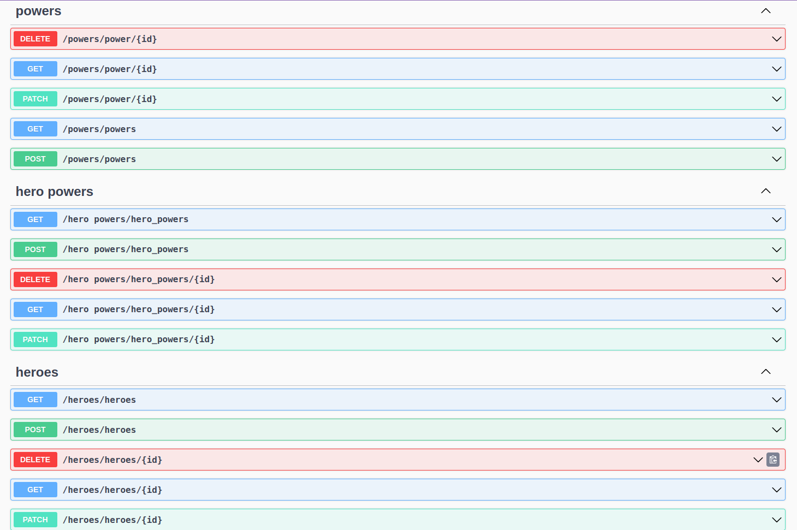

# Superheroes of the Galaxy - Flask

## Features

### Heroes

- Add a new a hero
- Get all heroes
- Find, update, or delete a hero by ID

### Powers

- Add a new power
- Get all powers
- Find, update, or delete a power by ID

### Hero Powers

- Associate hero with a power by creating HeroPower
- Find which hero has which power
- Find, update, or delete a HeroPower by ID
- Create a new HeroPower that is associated with an existing Power and Hero

## Installation

### 1. Clone the repository

git clone https://github.com/michellemwangi01/superheroes-api-flask/

### 2. Navigate to the project's directory

cd super-heroes-Flask-API

### 3. Install required dependencies

pip install -r requirements.txt

### 4. Activate the virtual environment

source venv/bin/activate

### 5. to populate the databse, run

python seed.py

### 6. Run the Flask server from the root directory

python app.py

### 7. Copy and past the link below to the browser and test the Api's

http://127.0.0.1:5555

## Author & License

Authored by [Michelle Mwangi](https://github.com/michellemwangi01).

Licensed under the [MIT License](LICENSE) - see the [LICENSE](LICENSE) file for details.
